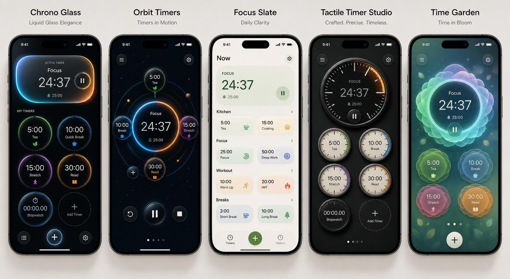

# TimerSimple iOS Portfolio

TimerSimple is a polished SwiftUI timer app designed around expressive timer experiences, fast everyday use, and App Store-ready product quality.

This public repository is a portfolio showcase only. The production source code, Xcode project, assets, binaries, and installable builds are intentionally not published here because TimerSimple is a commercial app planned for App Store release.

## Design Prototype

## Product Highlights

- SwiftUI iOS app with multiple premium visual timer themes.
- Real-time timer and stopwatch flows with pause, resume, reset, and completion alarm behavior.
- Custom timer creation, editing, reordering, labels, colors, fonts, sounds, vibration, and screen flash settings.
- Local notification support so timers can complete reliably outside the foreground app.
- Distinct UI directions including glass, orbital, slate, mechanical dial, and garden-inspired timer layouts.
- App Store-oriented project structure with reusable SwiftUI components and persistent user settings.

## Portfolio Scope

This repository is intended for recruiters, hiring managers, and collaborators who want a high-level view of the work without access to proprietary implementation details.

Not included:

- Source code
- Xcode project files
- App assets
- App Store build artifacts
- TestFlight or installable binaries

## Technology

- Swift
- SwiftUI
- Combine
- UIKit integrations
- UserNotifications
- iOS local persistence with `UserDefaults`

## Status

Private development repository maintained separately. Public distribution is planned through the App Store.

## Ownership

TimerSimple is proprietary software by Kadin Hunter. All rights reserved.
